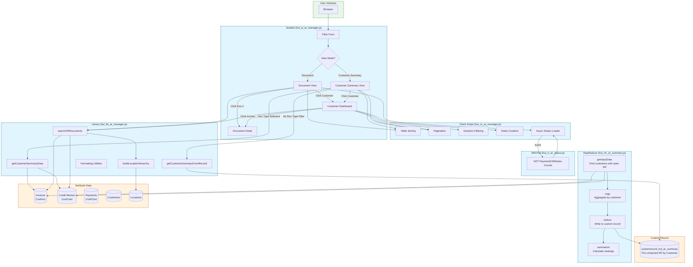
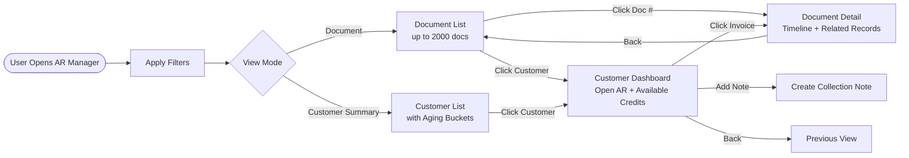

# PRD: AR Manager - Accounts Receivable Management Tool

**PRD ID:** PRD-20251230-ARManager
**Created:** December 30, 2025
**Last Updated:** January 9, 2026
**Author:** Thomas Showalter / Claude Code
**Status:** Production ✓
**Related Scripts:** hul_sl_ar_manager.js, hul_lib_ar_manager.js, hul_rl_ar_status.js, hul_cs_ar_manager.js, hul_mr_ar_summary.js

---

## Implementation Status

### Phase 1 MVP - COMPLETE ✓ (Dec 30, 2025)

**Deployed to NetSuite:**
| Script | Script ID | Deployment ID |
|--------|-----------|---------------|
| Suitelet | `customscript_hul_sl_ar_manager` | `customdeploy_hul_sl_ar_manager` |
| RESTlet | `customscript_hul_rl_ar_status` | `customdeploy_hul_rl_ar_status` |
| Client Script | `customscript_hul_cs_ar_manager` | *(attached to Suitelet)* |

**Features Implemented:**
- ✓ Filter form with all filter fields (doc#, customer, dates, doc type, location, days open, status)
- ✓ List view with all columns and status badges
- ✓ Async loading of payment/CM/notes counts via RESTlet
- ✓ Document Detail view with payment timeline and related records
- ✓ Customer Dashboard with aging buckets and available credits panel
- ✓ User notes display on Document Detail view

### Phase 2 - COMPLETE ✓ (Jan 4, 2026)

**New Scripts Deployed:**
| Script | Script ID | Deployment ID |
|--------|-----------|---------------|
| MapReduce | `customscript_hul_mr_ar_summary` | `customdeploy_hul_mr_ar_summary` |

**Features Implemented:**

#### MapReduce AR Summary (Pre-computed Customer Data)
- ✓ Processes all open AR transactions and aggregates by customer/location
- ✓ Stores results in `customrecord_hul_ar_summary` custom record
- ✓ Includes aging buckets: Current, 1-30, 31-60, 61-90, 91+ days
- ✓ Tracks: Total AR, Past Due Amount, Transaction Counts, Oldest Days Past Due
- ✓ Successfully processed 1,886 customer records on initial run

#### Customer Dashboard Enhancements
- ✓ Fixed client script attachment (was missing `form.clientScriptModulePath`)
- ✓ Fixed unapplied payments query (changed from wrong status `CustPymt:C` to `amountremaining > 0`)
- ✓ Reordered layout sections (Customer Info now after AR Summary, before Aging)
- ✓ Fixed notes query (use `userNotes` join instead of SuiteQL - fields NOT_EXPOSED)
- ✓ Fixed notes creation (set `direction = 1` for user notes)
- ✓ New notes appear instantly without page reload

#### Sales Rep Matrix Enhancements
- ✓ Fixed sales rep names display (use `BUILTIN.DF()` for multi-select employee field)
- ✓ Added missing columns: State, County, Override
- ✓ Added pagination (30 per page) with Prev/Next navigation
- ✓ Added dynamic filter field (searches all columns instantly)
- ✓ Filter preserves cursor position while typing

#### Collection Notes Enhancements
- ✓ Added pagination (30 per page) with Prev/Next navigation
- ✓ Added dynamic filter field (searches title, content, author, date)
- ✓ Client-side rendering from JSON data for better performance

#### UI/UX Improvements
- ✓ Darker section header background (#f8f9fa → #e2e6ea) for better visibility
- ✓ "Include Credit Balances" toggle to show customers with negative AR (credit balances)

**Record Verification:**
- Customer Summary shows 1,842 customers (positive AR balance)
- With "Include Credit Balances" enabled: 2,227 total records
- Difference of 385 records are customers with credit balances (negative AR) or $0 balance

### Phase 3 - COMPLETE ✓ (Jan 8, 2026) - PRODUCTION RELEASE

**Features Implemented:**

#### Customer Summary View Enhancements
- ✓ Customer filter now works in Customer Summary mode (was only working in Document mode)
- ✓ Document type filter now works in Customer Summary mode (uses live data aggregation when doc type selected)
- ✓ Added Location column between Customer and Total AR columns
- ✓ Split "91+" aging column into separate "91-120" and "120+" columns

#### Location Hierarchy Support
- ✓ Location filter now includes child locations (vans) when parent location selected
- ✓ Location display shows parent location instead of individual van names
- ✓ Built location hierarchy cache using SuiteQL for performance
- ✓ Location dropdown only shows parent locations (not individual vans)

#### Document View Enhancements
- ✓ Added "Partial Payment" column (Yes/- indicator)
- ✓ Added "Partial Payment" filter (All/Yes/No)
- ✓ Increased document limit from 1,000 to 2,000

**Technical Notes:**
- Location hierarchy uses SuiteQL instead of Search API (Search API doesn't support `parent` column on Location records)
- Module-level caching for location hierarchy to minimize queries
- 91-120 column shows $0 from pre-computed custom record (only has combined 91+ bucket); full breakdown available when filtering by doc type (uses live data)

### Phase 4 - COMPLETE ✓ (Jan 9, 2026) - Server-Side Pagination

**Features Implemented:**

#### Server-Side Pagination for Document View
- ✓ Handles 200K+ documents (191K invoices + 24K credit memos) without timeout
- ✓ Single Transaction search instead of separate Invoice/Credit Memo searches
- ✓ Efficient count via `runPaged().count` without loading all data
- ✓ Page-by-page fetching via `getRange(start, end)` - only loads current page
- ✓ Configurable page size dropdown (25/50/100/200 results per page)
- ✓ Pagination controls displayed above "AR Documents" header
- ✓ Page navigation reloads with bookmarkable URL parameters

#### Server-Side Sorting
- ✓ Sort by Date, Amount Remaining, Customer Name handled server-side
- ✓ Days Past Due sorting maps to Due Date column (inverted direction)
- ✓ Sort applied directly in search columns for optimal performance

**Technical Notes:**
- Uses `search.Type.TRANSACTION` with type filter `['CustInvc', 'CustCred']` for combined search
- Previous approach (separate searches per type, then combine) caused Script Execution Time Exceeded errors
- NetSuite's `search.createColumn()` doesn't accept `null` for sort property - must omit property entirely
- Days Past Due DESC = Due Date ASC (older due dates = more days past due)

---

## 1. Introduction / Overview

**What is this feature?**
An Accounts Receivable Manager Suitelet that provides visibility and management tools for $11M in trade receivables (GL Account 11110, internal ID 428). Built following the Parts G/L Tracker architecture pattern.

**What problem does it solve?**
- Branch managers cannot easily see aging invoices for their location
- No centralized view of open AR with aging analysis
- Difficult to identify which invoices need follow-up
- No way to quickly see a customer's AR status with available credits
- Time-consuming to research individual invoices and their payment/credit memo history

**Primary Goal:**
Provide a view-only tool that enables branch managers to identify, research, and prioritize accounts receivable items for collection or write-off.

---

## 2. Goals

1. **Aging Visibility** - See all open invoices/credit memos with days open and days past due
2. **Location Filtering** - Filter by branch so managers can focus on their AR
3. **Customer Dashboard** - View customer's complete AR picture including available credits
4. **Document Research** - Deep-dive into any invoice to see payment/CM history
5. **Proactive Monitoring** - Filter by aging threshold (>30, >60, >90, >120, >180 days)

---

## 3. User Stories

1. **As a** Branch Manager, **I want to** see all invoices for my location that are over 60 days old **so that** I can prioritize collection calls.

2. **As a** Controller, **I want to** view the aging breakdown by customer **so that** I can identify problem accounts.

3. **As an** AR Clerk, **I want to** see what payments and credit memos are applied to an invoice **so that** I can understand the payment history.

4. **As a** CFO, **I want to** see total open AR with aging buckets **so that** I can monitor cash flow risks.

5. **As a** Branch Manager, **I want to** see if a customer has unapplied credits **so that** I can suggest applying them to open invoices.

---

## 4. Functional Requirements

### Phase 1: MVP - Search & List View

1. The system must allow filtering by:
   - Date range (invoice date)
   - Document type prefix (W, PS, R, S, FIN, MC for invoices; CM for credit memos)
   - Customer
   - Location/Branch
   - Days Open threshold (>30, >60, >90, >120, >180)
   - Status (Open, Partially Paid, Closed)

2. The system must display a list view showing:
   - Document number (clickable)
   - Customer name (clickable to customer dashboard)
   - Invoice date
   - Due date
   - Total amount
   - Amount remaining
   - Days Open (from invoice date)
   - Days Past Due (from due date)
   - Location/Branch
   - Status badge (color-coded)

3. The system must async-load additional data via RESTlet:
   - Applied payments count
   - Applied credit memos count
   - User notes count

### Phase 2: Document Detail View

4. Clicking a document shows detail view with:
   - Header: Document info, customer link, location, revenue stream
   - Timeline: Document created → Payments applied → CMs applied → Current status
   - Related Records: Source SO, Payments, Credit Memos (all clickable)
   - User Notes from standard NetSuite User Notes sublist

### Phase 3: Customer Dashboard View

5. Clicking a customer name shows dashboard with:
   - Two-panel layout: Open Invoices | Available Credits/Unapplied Payments
   - Aging buckets: Current, 1-30, 31-60, 61-90, 91-120, 120+
   - Total AR balance
   - Click any invoice to go to document detail

---

## 5. Non-Goals (Out of Scope) - MVP

**This MVP will NOT:**
- Apply credits or payments (view-only)
- Create write-off journal entries
- Send automated alerts or emails
- Modify User Notes (read-only display)
- Create collection tasks

---

## 6. Technical Design

### Document Type Prefixes
| Type | Prefix | Example |
|------|--------|---------|
| Service Invoice | W | W1234-1, W1234-2 |
| Parts Sales Invoice | PS | PS5678-1 |
| Rental Invoice | R | R9012-1 |
| Equipment Invoice | S | S3456-1 |
| Finance Invoice | FIN | FIN789-1 |
| Misc/Manual Invoice | MC | MC012-1 |
| Credit Memo | CM | CM345 |

### Status Definitions
| Status | Color | Criteria |
|--------|-------|----------|
| Open | Yellow (#ffc107) | Amount remaining = total, not past due |
| Partial | Blue (#17a2b8) | Amount remaining < total, not past due |
| Closed | Green (#28a745) | Amount remaining = 0 |
| Overdue | Red (#dc3545) | Any open amount AND past due date |

### Aging Buckets
| Bucket | Days Past Due |
|--------|---------------|
| Current | Not past due (≤0 days) |
| 1-30 | 1-30 days past due |
| 31-60 | 31-60 days past due |
| 61-90 | 61-90 days past due |
| 91-120 | 91-120 days past due |
| 120+ | More than 120 days past due |

### Key GL Account
- **11110** (Internal ID: 428) - Trade Receivables

### API Constraints
| Field | SuiteQL | Search API | Solution |
|-------|---------|------------|----------|
| `amountremaining` | NOT_EXPOSED | ✓ Works | Use Search API |
| `status` | NOT_EXPOSED | ✓ Works | Use Search API |
| `createdfrom` | NOT_EXPOSED | ✓ Works | Use Search API |
| 4000 result limit | N/A | Applies | Batch by 50 items |

---

## 7. System Architecture



### User Flow Summary



---

## 8. File Structure

```
FileCabinet/SuiteScripts/HUL_DEV/ADMIN_DEV/
├── Suitelets/hul_sl_ar_manager.js           # Main Suitelet
├── Libraries/hul_lib_ar_manager.js          # Shared library
├── RESTlets/hul_rl_ar_status.js             # Async status loader
├── ClientScripts/hul_cs_ar_manager.js       # Client interactivity
├── MapReduce/hul_mr_ar_summary.js           # Pre-compute customer AR data
└── Documentation/PRDs/PRD-20251230-ARManager.md
```

### Custom Record: HUL AR Customer Summary
| Field ID | Label | Type | Purpose |
|----------|-------|------|---------|
| `custrecord_ars_customer` | Customer | List/Record | Customer reference |
| `custrecord_ars_location` | Location | List/Record | Location reference |
| `custrecord_ars_total_ar` | Total AR | Currency | Total AR balance |
| `custrecord_ars_past_due_amt` | Past Due Amount | Currency | Amount past due |
| `custrecord_ars_oldest_days` | Oldest Days Past Due | Integer | Days of oldest past due invoice |
| `custrecord_ars_txn_count` | Transaction Count | Integer | Total open transactions |
| `custrecord_ars_past_due_txn` | Past Due Transactions | Integer | Count of past due transactions |
| `custrecord_ars_current` | Aging Current | Currency | Not past due |
| `custrecord_ars_1_30` | Aging 1-30 | Currency | 1-30 days past due |
| `custrecord_ars_31_60` | Aging 31-60 | Currency | 31-60 days past due |
| `custrecord_ars_61_90` | Aging 61-90 | Currency | 61-90 days past due |
| `custrecord_ars_over_90` | Aging 91+ | Currency | Over 90 days past due |
| `custrecord_ars_last_updated` | Last Updated | Date/Time | MapReduce run timestamp |

---

## 9. User Interface

### List View Columns
| Column | Width | Source | Notes |
|--------|-------|--------|-------|
| Doc # | 120px | tranid | Clickable link to detail view |
| Customer | 200px | entity | Clickable link to customer dashboard |
| Date | 90px | trandate | Invoice date |
| Due | 90px | duedate | Payment due date |
| Amount | 100px | amount | Total invoice amount |
| Remaining | 100px | amountremaining | Outstanding balance |
| Days Open | 70px | Calculated | From invoice date |
| Days Past Due | 70px | Calculated | From due date (0 if not past due) |
| Location | 120px | location | Branch/location name |
| Status | 100px | Calculated | Color-coded badge |
| Info | 80px | Async | Applied counts, notes count |

### Filter Fields
| Field | Type | Required | Notes |
|-------|------|----------|-------|
| Document # | Text | No | Partial match search |
| Customer | Select | No | Customer dropdown |
| Date From | Date | For date search | Start of range |
| Date To | Date | For date search | End of range |
| Doc Type | Select | For date search | W, PS, R, S, FIN, MC, CM, or All |
| Location | Select | No | Branch filter |
| Days Open | Select | No | >30, >60, >90, >120, >180 |
| Status | Select | No | Open, Partial, Closed, Overdue, All |

---

## 10. Revision History

| Date | Author | Version | Changes |
|------|--------|---------|---------|
| 2025-12-30 | Thomas Showalter / Claude Code | 1.0 | Initial draft - Phase 1 MVP |
| 2026-01-04 | Thomas Showalter / Claude Code | 2.0 | Phase 2 - MapReduce, Dashboard fixes, Pagination/Filtering |
| 2026-01-08 | Thomas Showalter / Claude Code | 3.0 | Phase 3 - Production release. Customer/DocType filters in Summary mode, Location column & hierarchy, 91-120/120+ split, Partial Payment filter, 2000 doc limit |
| 2026-01-09 | Thomas Showalter / Claude Code | 4.0 | Phase 4 - Server-side pagination for 200K+ documents. Single Transaction search, page size dropdown, efficient count/fetch |

---

## 11. Future Roadmap

### Completed in MVP (Originally Phase 2 & 3)
- ~~Document detail view with timeline~~ ✓
- ~~Related records grid~~ ✓
- ~~User notes display~~ ✓
- ~~Customer dashboard view~~ ✓
- ~~Aging bucket visualization~~ ✓
- ~~Available credits panel~~ ✓

### Completed in Phase 2 (Jan 4, 2026)
- ~~MapReduce for pre-computed customer AR data~~ ✓
- ~~Sales Rep Matrix with all columns~~ ✓
- ~~Pagination and filtering on data tables~~ ✓
- ~~Add ability to create collection notes~~ ✓
- ~~Credit balance toggle~~ ✓

### Completed in Phase 3 (Jan 8, 2026) - Production
- ~~Customer filter in Customer Summary mode~~ ✓
- ~~Document type filter in Customer Summary mode~~ ✓
- ~~Location column in Customer Summary~~ ✓
- ~~91-120 and 120+ aging columns (split from 91+)~~ ✓
- ~~Location hierarchy (parent/child support)~~ ✓
- ~~Partial Payment column and filter~~ ✓
- ~~Increase document limit to 2000~~ ✓

### Future Enhancements (Not Started)
- Email alerts for aging thresholds
- Integration with collection workflows
- Apply credits directly from tool
- Create write-off journal entries
- Dashboard widgets for AR summary
- Add "Take Responsibility" button for branch managers
- Export to Excel functionality
- Scheduled MapReduce run (daily refresh of AR Summary data)

---

## 12. Lessons Learned & Gotchas

### NetSuite API Gotchas Discovered

#### User Notes - SuiteQL Fields NOT_EXPOSED
**Problem:** Querying the `note` table via SuiteQL fails with `NOT_EXPOSED` errors for fields like `title`, `note`, `author`, `notedate`, `direction`.

**Solution:** Search from the PARENT record with `join: 'userNotes'` (camelCase!):
```javascript
// WRONG - SuiteQL on note table
query.runSuiteQL({ query: 'SELECT n.title FROM note n WHERE n.entity = ?' });
// Error: Field 'title' NOT_EXPOSED

// CORRECT - Search from parent with userNotes join
search.create({
    type: search.Type.CUSTOMER,  // or custom record type
    filters: [['internalid', 'is', customerId]],
    columns: [
        { name: 'title', join: 'userNotes' },
        { name: 'note', join: 'userNotes' },
        { name: 'notedate', join: 'userNotes' },
        { name: 'author', join: 'userNotes' }
    ]
});
```

#### Note Creation - Entity vs Record Fields
**For standard records (Customer, Vendor, etc.):** Use `entity` field
```javascript
noteRecord.setValue({ fieldId: 'entity', value: customerId });
```

**For custom records:** Use `record` and `recordtype` fields
```javascript
noteRecord.setValue({ fieldId: 'record', value: recordId });
noteRecord.setValue({ fieldId: 'recordtype', value: 'customrecord_xxx' });
```

#### Payment Status Codes
**Problem:** Used `['status', 'anyof', 'CustPymt:C']` thinking it meant "unapplied" but it actually means "Deposited".

**Solution:** Filter by `amountremaining > 0` for truly unapplied payments:
```javascript
// WRONG - CustPymt:C = Deposited, NOT Unapplied
['status', 'anyof', 'CustPymt:C']

// CORRECT - Check actual remaining amount
['amountremaining', 'greaterthan', 0]
```

#### Client Script Attachment on Suitelets
**Problem:** Buttons calling client script functions didn't work on Customer Dashboard.

**Root Cause:** The `handleCustomerDashboard()` function created a form but never attached the client script.

**Solution:** Always add `form.clientScriptModulePath` when creating forms with button handlers:
```javascript
form.clientScriptModulePath = '../ClientScripts/hul_cs_ar_manager.js';
```

#### Multi-Select Field Display Values
**Problem:** Sales Rep Matrix showed "-" instead of employee names.

**Root Cause:** Multi-select employee fields store comma-separated IDs, manual lookup was failing.

**Solution:** Use `BUILTIN.DF()` in SuiteQL to get display values directly:
```javascript
// WRONG - Manual ID parsing and lookup
const repIds = String(row.sales_reps).split(',');
// Then loop and lookup each... slow and error-prone

// CORRECT - Let NetSuite resolve display values
SELECT BUILTIN.DF(m.custrecord_salesrep_mapping_sales_reps) AS sales_reps
```

#### Location Parent Field - Search API Invalid Column
**Problem:** Search API throws `An nlobjSearchColumn contains an invalid column: parent` when trying to get parent location.

**Root Cause:** The `parent` field on Location records is not exposed to Search API columns.

**Solution:** Use SuiteQL instead:
```javascript
// WRONG - Search API for location hierarchy
search.create({
    type: search.Type.LOCATION,
    columns: [
        search.createColumn({ name: 'parent' })  // FAILS!
    ]
});

// CORRECT - SuiteQL for location hierarchy
const sqlQuery = `
    SELECT
        loc.id AS locId,
        loc.name AS locName,
        loc.parent AS parentId,
        parent_loc.name AS parentName
    FROM location loc
    LEFT JOIN location parent_loc ON loc.parent = parent_loc.id
    WHERE loc.isinactive = 'F'
`;
```

#### Search Column Sort Property - Cannot Be Null
**Problem:** Setting `sort: null` on a search column throws `Error: Wrong parameter type: null is expected as ["ASC","DESC","NONE"]`.

**Root Cause:** NetSuite's `search.createColumn()` doesn't accept `null` for the sort property - it expects the property to be omitted entirely or set to a valid value.

**Solution:** Conditionally create columns with or without the sort property:
```javascript
// WRONG - null not accepted
search.createColumn({ name: 'trandate', sort: sortColumn === 'trandate' ? sortDir : null })

// CORRECT - omit sort property when not sorting by this column
sortColumn === 'trandate'
    ? search.createColumn({ name: 'trandate', sort: sortDir })
    : search.createColumn({ name: 'trandate' })
```

#### Large Result Sets - Use Transaction Search for Combined Types
**Problem:** Searching 191K invoices + 24K credit memos separately and combining results caused Script Execution Time Exceeded errors.

**Solution:** Use `search.Type.TRANSACTION` with type filter instead of separate searches:
```javascript
// WRONG - Two separate searches, combine results (times out with large data)
const invoiceResults = searchDocumentType(search.Type.INVOICE, ...);
const creditMemoResults = searchDocumentType(search.Type.CREDIT_MEMO, ...);
const combined = invoiceResults.concat(creditMemoResults); // 200K+ records!

// CORRECT - Single Transaction search with type filter
const docSearch = search.create({
    type: search.Type.TRANSACTION,
    filters: [
        ['mainline', 'is', 'T'],
        'AND',
        ['type', 'anyof', ['CustInvc', 'CustCred']]  // Both types in one search
    ],
    columns: searchColumns
});

// Get count efficiently
const totalCount = docSearch.runPaged({ pageSize: 1000 }).count;

// Fetch only the requested page
const pageResults = docSearch.run().getRange({ start: 0, end: 50 });
```

### UX Lessons Learned

#### Dynamic Filter Input Focus
**Problem:** Re-rendering HTML on each keystroke caused the input field to lose focus.

**Solution:** Store cursor position before render, restore focus and cursor after:
```javascript
var cursorPos = input.selectionStart;
// ... re-render HTML ...
newInput.focus();
newInput.setSelectionRange(cursorPos, cursorPos);
```

#### Client-Side vs Server-Side Rendering for Dynamic Data
**Problem:** Notes rendered server-side couldn't be paginated/filtered without page reload.

**Solution:** Pass data as JSON to client, render dynamically:
```javascript
// Suitelet: Pass data as JSON
html += `<script>window.customerNotesData = ${JSON.stringify(notesData)};</script>`;

// Client Script: Render from JSON in pageInit
if (window.customerNotesData) {
    renderNotes(container, window.customerNotesData, 1, true);
}
```

#### Timing of Client Script Initialization
**Problem:** Inline script calling `initNotesDisplay()` ran before client script loaded.

**Solution:** Call initialization from client script's `pageInit`, not inline script:
```javascript
// In pageInit:
if (window.customerNotesData) {
    var notesContainer = document.getElementById('notes-list-container');
    if (notesContainer) {
        renderNotes(notesContainer, window.customerNotesData, 1, true);
    }
}
```

### Data Quality Insights

#### Customer Summary Record Count Discrepancy
- **AR Manager showed:** 1,842 customers
- **NetSuite custom record list showed:** 2,227 records
- **Difference:** 385 records

**Root Cause:** AR Manager query filtered `WHERE total_ar > 0` to show only customers who owe money.

**Resolution:** Added "Include Credit Balances" checkbox toggle to optionally show customers with negative AR (credit balances) or $0 balance.
