# Vendor Credit Processor - System Flowchart

**Last Updated:** January 6, 2026

This flowchart shows the complete vendor credit processing pipeline including bypass mode, PO validation, and VRA matching.

```mermaid
flowchart TD
    subgraph INTAKE["PDF Intake"]
        A[PDF Uploaded to File Cabinet] --> B{Which Folder?}
        B -->|Parts| C1[Incoming/Parts]
        B -->|Warranty| C2[Incoming/Warranty]
        B -->|Sales| C3[Incoming/Sales]
        C1 & C2 & C3 --> D[Monitor Detects New Files]
    end

    subgraph OCR["OCR Processing"]
        D --> E[Create Processing Log<br/>Status: RECEIVED]
        E --> F[Move to Processing Folder]
        F --> G[Call Mistral AI OCR]
        G --> H{OCR Success?}
        H -->|Yes| I[Store Raw OCR Data<br/>Status: OCR_COMPLETE]
        H -->|No| J{Retry Count < 5?}
        J -->|Yes| K[Schedule Retry<br/>Exponential Backoff]
        K --> G
        J -->|No| L[Status: FAILED<br/>Move to Failed Folder]
    end

    subgraph NORMALIZE["Normalization"]
        I --> M[Load Vendor Config]
        M --> N{Vendor Found<br/>Locally?}
        N -->|Yes| P[Vendor Identified via Config]
        N -->|No| O{Check Learned<br/>Aliases?}
        O -->|Found| P
        O -->|Not Found| Q[AI Vector Matching<br/>OpenAI to Supabase]
        Q --> R{AI Match<br/>70% or higher?}
        R -->|Yes, 90%+| S[Auto-save Learned Alias]
        S --> T[Create Default Config]
        R -->|Yes, 70-89%| T
        T --> P
        R -->|No| U[No Vendor Match<br/>Add Warning]
        U --> P

        P --> V{PO Number<br/>in OCR Data?}
        V -->|Yes| W[Lookup PO in NetSuite<br/>Get PO Vendor]
        W --> X{PO Vendor =<br/>AI/Config Vendor?}
        X -->|No| AC[VENDOR_PO_MISMATCH<br/>Status: REVIEW_REQUIRED]
        X -->|Yes| Y[Vendor Confirmed<br/>Store PO Reference]
        V -->|No| Y

        Y --> Z[Apply Vendor Rules]
        Z --> AA[Normalize OCR Data]
        AA --> AB[Detect Fees by Location<br/>Restock/Core/Freight/Misc]
        AB --> AD[Calculate Totals]
        AD --> AE[Calculate Quality Score]
    end

    subgraph ROUTING["Quality Routing"]
        AE --> QA{Bypass Mode<br/>Enabled?}
        QA -->|Yes| AF[Skip Quality Check<br/>Status: PENDING_MATCH]
        QA -->|No| AG{Quality Score?}
        AG -->|85+| AF
        AG -->|70-84| AH[Status: REVIEW_REQUIRED<br/>Reason: needs_review]
        AG -->|Below 70| AI[Status: REVIEW_REQUIRED<br/>Reason: low_quality]
    end

    subgraph MATCHING["VRA Matching"]
        AF --> AJ[Status: MATCHING]
        AJ --> AK{Strategy 1:<br/>Direct VRA Number}
        AK -->|Found| AL[Match Found<br/>100% Confidence]
        AK -->|Not Found| AM{Strategy 2:<br/>PO Lookup}
        AM -->|Found| AN[Match Found<br/>95% Confidence]
        AM -->|Not Found| AO{Strategy 3:<br/>Vendor + Items}
        AO -->|Found| AP[Match Found<br/>60-90% Confidence]
        AO -->|Not Found| AQ{Bypass Mode?}

        AQ -->|Yes| AR[No Match - Proceed Anyway<br/>Method: bypass_no_match]
        AQ -->|No| AS[Status: REVIEW_REQUIRED<br/>Error: VRA_NO_MATCH]

        AL & AN & AP --> AT[Status: MATCHED<br/>Store VRA Reference]
        AR --> AT
    end

    subgraph CASE["Case Creation"]
        AT --> AU{Case Already<br/>Exists?}
        AU -->|Yes| AV[Skip - Already Created]
        AU -->|No| AW[Create Support Case]
        AW --> AX[Attach PDF]
        AX --> AY[Link to VRA if matched]
        AY --> AZ[Status: CASE_CREATED]
        AZ --> BA[Move PDF to Processed]
        BA --> BB[Status: COMPLETED]
    end

    subgraph REVIEW["Review Queue"]
        AC & AH & AI & AS --> BC[Review Queue]
        BC --> BD{User Action}
        BD -->|Approve| BE[Update Vendor if Corrected]
        BE --> AF
        BD -->|Skip VRA, Create Case| AT
        BD -->|Reject| BF[Status: FAILED]
    end

    style INTAKE fill:#e1f5fe
    style OCR fill:#fff3e0
    style NORMALIZE fill:#f3e5f5
    style ROUTING fill:#fff8e1
    style MATCHING fill:#e3f2fd
    style CASE fill:#e8f5e9
    style REVIEW fill:#ffebee
    style AC fill:#ffcdd2
    style AH fill:#ffecb3
    style AI fill:#ffecb3
    style AS fill:#ffcdd2
    style L fill:#ffcdd2
    style BF fill:#ffcdd2
    style BB fill:#c8e6c9
    style AR fill:#b3e5fc
    style AE fill:#b3e5fc
    style AQ fill:#b3e5fc
```



## Status Flow Summary

```
RECEIVED → OCR_PENDING → OCR_COMPLETE → NORMALIZING → PENDING_MATCH → MATCHING → MATCHED → CASE_CREATED → COMPLETED
                ↑                              ↓                           ↓
                └────── (retry) ───────────────┘                           ↓
                                               ↓                           ↓
                                        REVIEW_REQUIRED ←──────────────────┘
                                               ↓
                                            FAILED
```

## Bypass Mode

When bypass mode is enabled (via script deployment parameters):

| Checkpoint | Normal Behavior | Bypass Behavior |
|------------|-----------------|-----------------|
| Quality Score < 85 | REVIEW_REQUIRED | PENDING_MATCH |
| No VRA Match | REVIEW_REQUIRED | MATCHED (proceed to case) |
| Vendor/PO Mismatch | REVIEW_REQUIRED | REVIEW_REQUIRED (still blocked) |

**Enable bypass mode:**
- `custscript_vcn_bypass_mode` on Normalize MapReduce
- `custscript_vcm_bypass_mode` on Match MapReduce

## Key Decision Points

1. **Vendor Matching** - Local config → Learned aliases → AI vector search
2. **PO Validation** - Verifies AI-detected vendor matches PO vendor
3. **Quality Routing** - Score-based routing (bypass skips this)
4. **VRA Matching** - 3-tier cascade: Direct → PO Lookup → Vendor+Items
5. **Case Creation** - Duplicate detection before creating
